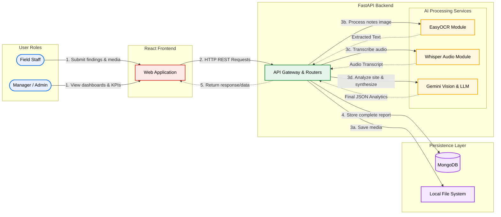

# Field Visit Monitoring and Analytics System

This project is a comprehensive system designed for field staff to submit visit observations and for managers to access advanced analytics dashboards. The system leverages AI services (OCR, Whisper, and Gemini) to automatically process handwritten notes, audio recordings, and site images to generate actionable insights.

## 1. Setup Instructions

### Prerequisites
- Python 3.9+
- Node.js 16+
- MongoDB instance (running locally on `mongodb://localhost:27017` or configured via `.env`)

### Backend Setup
1. Open a terminal and navigate to the `backend` folder:
   ```bash
   cd backend
   ```
2. Create and activate a virtual environment:
   ```bash
   python -m venv fieldsight
   
   # Windows:
   .\fieldsight\Scripts\activate
   
   # macOS/Linux:
   source fieldsight/bin/activate
   ```
3. Install the dependencies:
   ```bash
   pip install -r requirements.txt
   ```
4. Create a `.env` file in the `backend` directory with your environment variables (e.g., `GEMINI_API_KEY`, database URL, etc.).

### Frontend Setup
1. Open a terminal and navigate to the `frontend` folder:
   ```bash
   cd frontend
   ```
2. Install the dependencies:
   ```bash
   npm install
   ```

## 2. Running the Servers

### Starting the Backend
From the `backend` directory with your virtual environment activated, run:
```bash
uvicorn server:app --reload --host 0.0.0.0 --port 8000
```
*The backend API will be available at `http://localhost:8000`*

### Starting the Frontend
From the `frontend` directory, run:
```bash
npm start
```
*The React app will launch automatically in your browser at `http://localhost:3000`*

## 3. Backend Routes

### Root
- `GET /` : Health check endpoint.

### Authentication (`/auth`)
- `POST /auth/signup` : Register a new user (admin or staff).
- `POST /auth/login` : Authenticate a user and return a JWT access token.

### Field Findings (`/api`)
- `POST /api/post_findings` : Submit a new field finding. Accepts form data along with file uploads (notes image, site image, audio file). 

### Admin Analytics (`/api/admin`)
- `GET /api/admin/users` : Retrieve a list of all registered users.
- `GET /api/admin/users/{user_id}/reports` : Get all reports submitted by a specific user.
- `GET /api/admin/reports/{report_id}` : Get the detailed view of a specific report.
- `GET /api/admin/analytics/locations` : Get a distinct list of all active regions/locations.
- `GET /api/admin/analytics/kpis` : Retrieve key performance indicators (e.g., total visits, critical issues).
- `GET /api/admin/analytics/issue-types` : Aggregation of common issue types found.
- `GET /api/admin/analytics/sentiment` : Overall sentiment analysis breakdown.
- `GET /api/admin/analytics/trends` : Issue trends over time (daily, weekly, monthly).
- `GET /api/admin/analytics/stakeholders` : Frequency of stakeholders met.
- `GET /api/admin/analytics/follow-up-priority` : Priority distribution of follow-up actions.

### Dashboard (`/dashboard`)
- `GET /dashboard/findings` : Fetch all findings, with optional date filtering.
- `GET /dashboard/finding/{finding_id}` : Retrieve a single finding by its ID.
- `GET /dashboard/staff/{user_id}` : Retrieve all findings for a specific staff member.

## 4. Backend Services

The backend integrates deeply with AI models for data processing, separated into individual services:

- **OCR Service (`ocr_service.py`)**: Uses EasyOCR to extract handwritten or typed text from uploaded images of field notes.
- **Audio Service (`audio_service.py`)**: Interfaces with speech-to-text models (Whisper) to generate accurate transcripts from audio recordings.
- **Gemini Service (`gemini_service.py`)**:
  - `analyze_site_image`: Passes uploaded site images to Gemini Vision to detect infrastructure, facilities, and potential hazards.
  - `generate_final_analytics`: Takes the combined OCR text, audio transcript, and image analysis, passing them to a Gemini language model to extract key findings, blockers, structured follow-up priorities, and sentiment.

## 5. Architecture & Workflow Diagram


