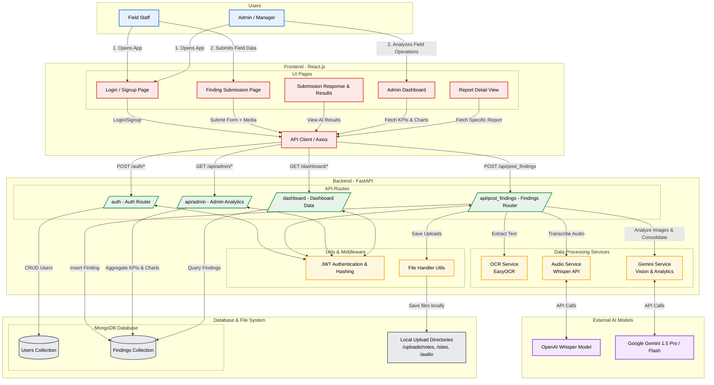

```mermaid
graph TB
    %% =======================
    %% ACTORS
    %% =======================
    subgraph Actors [Users]
        Staff[Field Staff]
        Admin[Admin / Manager]
    end

    %% =======================
    %% FRONTEND LAYER (React)
    %% =======================
    subgraph Frontend [Frontend - React.js]
        subgraph Pages [UI Pages]
            AuthUI[Login / Signup Page]
            SubmitUI[Finding Submission Page]
            ResponseUI[Submission Response & Results]
            DashUI[Admin Dashboard]
            ReportUI[Report Detail View]
        end
        
        API_Client[API Client / Axios]
        
        %% Internal routing
        AuthUI -->|Login/Signup| API_Client
        SubmitUI -->|Submit Form + Media| API_Client
        ResponseUI -->|View AI Results| API_Client
        DashUI -->|Fetch KPIs & Charts| API_Client
        ReportUI -->|Fetch Specific Report| API_Client
    end

    %% =======================
    %% BACKEND LAYER (FastAPI)
    %% =======================
    subgraph Backend [Backend - FastAPI]
        subgraph Routers [API Routes]
            RouteAuth[/auth - Auth Router/]
            RouteFind[/api/post_findings - Findings Router/]
            RouteAdmin[/api/admin - Admin Analytics/]
            RouteDash[/dashboard - Dashboard Data/]
        end

        subgraph Core Logic [Utils & Middleware]
            AuthUtil[JWT Authentication & Hashing]
            FileHnd[File Handler Utils]
        end

        subgraph AI Services [Data Processing Services]
            OCR[OCR Service<br/>EasyOCR]
            Audio[Audio Service<br/>Whisper API]
            Gemini[Gemini Service<br/>Vision & Analytics]
        end

        %% Connections within Backend
        API_Client -->|POST /auth/*| RouteAuth
        API_Client -->|POST /api/post_findings| RouteFind
        API_Client -->|GET /api/admin/*| RouteAdmin
        API_Client -->|GET /dashboard/*| RouteDash

        RouteAuth <--> AuthUtil
        RouteFind <--> AuthUtil
        RouteAdmin <--> AuthUtil
        RouteDash <--> AuthUtil

        RouteFind -->|Save Uploads| FileHnd
        RouteFind -->|Extract Text| OCR
        RouteFind -->|Transcribe Audio| Audio
        RouteFind -->|Analyze Images & Consolidate| Gemini
    end

    %% =======================
    %% EXTERNAL APIS & MODELS
    %% =======================
    subgraph External [External AI Models]
        ExtWhisper[OpenAI Whisper Model]
        ExtGeminiVision[Google Gemini 1.5 Pro / Flash]
    end
    
    Audio <-->|API Calls| ExtWhisper
    Gemini <-->|API Calls| ExtGeminiVision

    %% =======================
    %% DATA PERSISTENCE LAYER
    %% =======================
    subgraph Storage [Database & File System]
        subgraph MongoDB [MongoDB Database]
            ColUsers[(Users Collection)]
            ColFindings[(Findings Collection)]
        end
        
        LocalFiles[Local Upload Directories<br/>/uploads/notes, /sites, /audio]
    end

    %% DB Connections
    RouteAuth -->|CRUD Users| ColUsers
    RouteFind -->|Insert Finding| ColFindings
    RouteAdmin -->|Aggregate KPIs & Charts| ColFindings
    RouteDash -->|Query Findings| ColFindings
    
    FileHnd -->|Save files locally| LocalFiles

    %% =======================
    %% PRIMARY USER FLOWS
    %% =======================
    Staff -->|1. Opens App| AuthUI
    Staff -->|2. Submits Field Data| SubmitUI
    Admin -->|1. Opens App| AuthUI
    Admin -->|2. Analyzes Field Operations| DashUI
    
    %% Style formatting
    classDef default fill:#f9f9f9,stroke:#333,stroke-width:1px;
    classDef actor fill:#e8f0fe,stroke:#1a73e8,stroke-width:2px,color:#000;
    classDef ui fill:#fce8e6,stroke:#d93025,stroke-width:2px,color:#000;
    classDef route fill:#e6f4ea,stroke:#1e8e3e,stroke-width:2px,color:#000;
    classDef service fill:#fef7e0,stroke:#f9ab00,stroke-width:2px,color:#000;
    classDef ext fill:#f3e8fd,stroke:#9334e6,stroke-width:2px,color:#000;
    classDef db fill:#e8eaed,stroke:#5f6368,stroke-width:2px,color:#000;

    class Staff,Admin actor;
    class AuthUI,SubmitUI,ResponseUI,DashUI,ReportUI,API_Client ui;
    class RouteAuth,RouteFind,RouteAdmin,RouteDash route;
    class OCR,Audio,Gemini,FileHnd,AuthUtil service;
    class ExtWhisper,ExtGeminiVision ext;
    class ColUsers,ColFindings,LocalFiles db;
```
